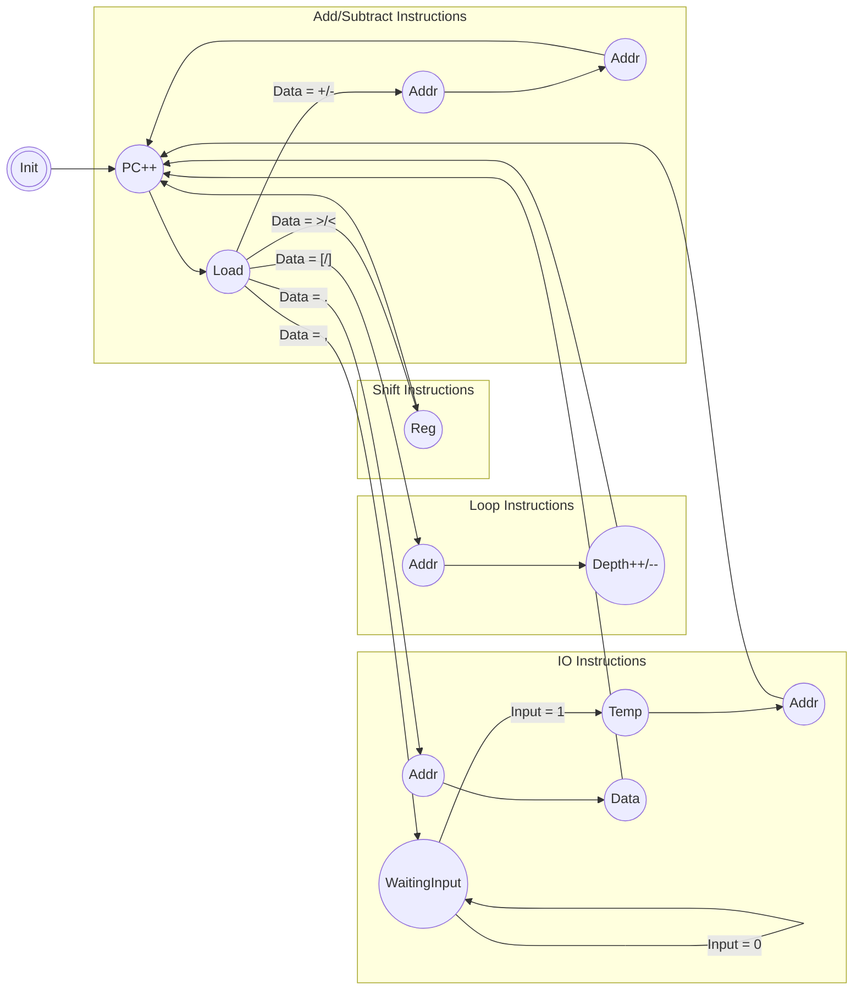

  

# Brainf\*ck Processor for Tiny Tapeout

## What is this project

This is a second version of my implementation of a [Brainf\*ck Processor](https://github.com/loco-choco/bf-processor/tree/main), with an architecture for the Tiny Tapeout project.

## State Machine

