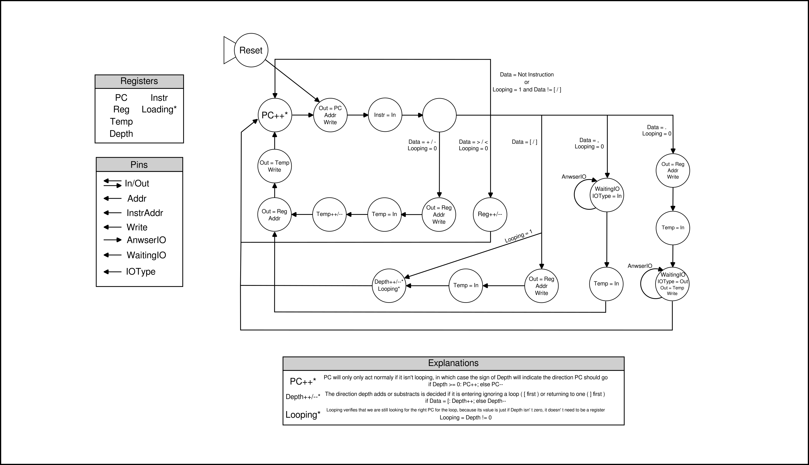
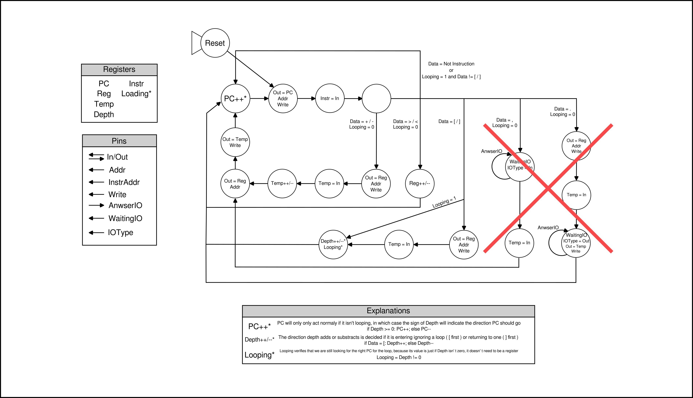
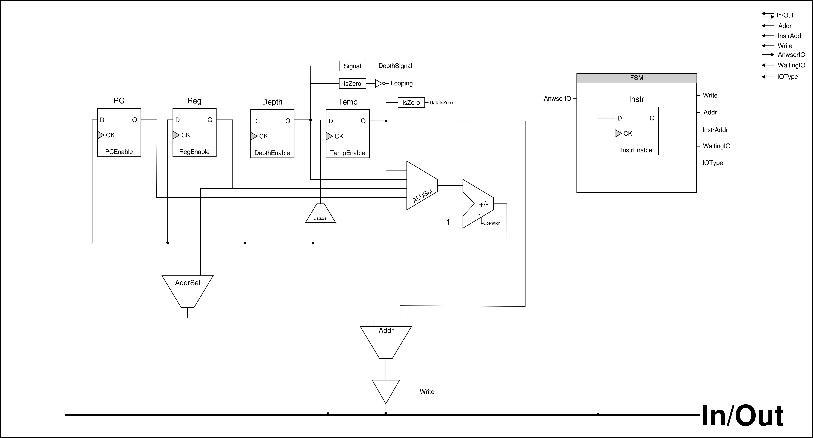
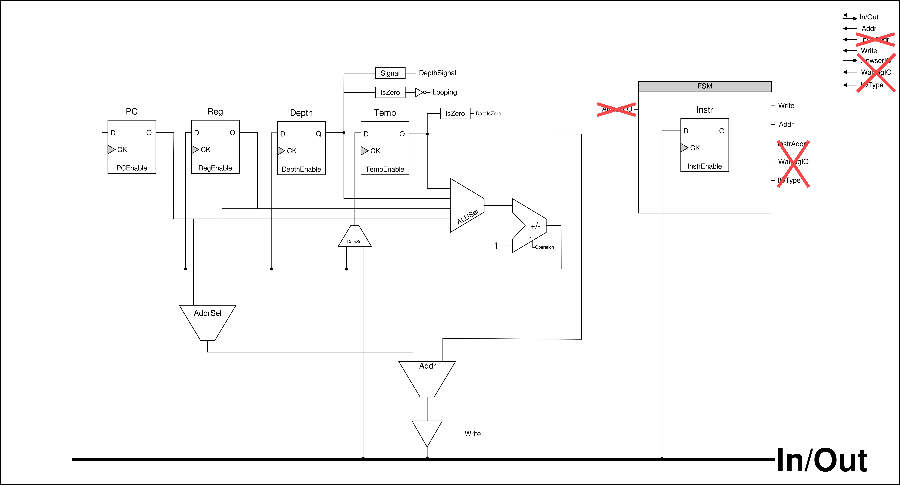

  

# Brainf\*ck Processor for Tiny Tapeout (_BF3b4_)

## What is this project

This is a second version of my implementation of a [Brainf\*ck Processor](https://github.com/loco-choco/bf-processor/tree/main), with an architecture for the Tiny Tapeout project.
Because of some limitations and time constraints, it only implements 6 out of the 8 instructions, BF has, hence the name _BF3b4_ (BF 3/4).

## Circuit Pinout

## State Machine

## State Machine - For Tiny Tapeout

## Circuit Diagram

## Circuit Diagram - For Tiny Tapeout

